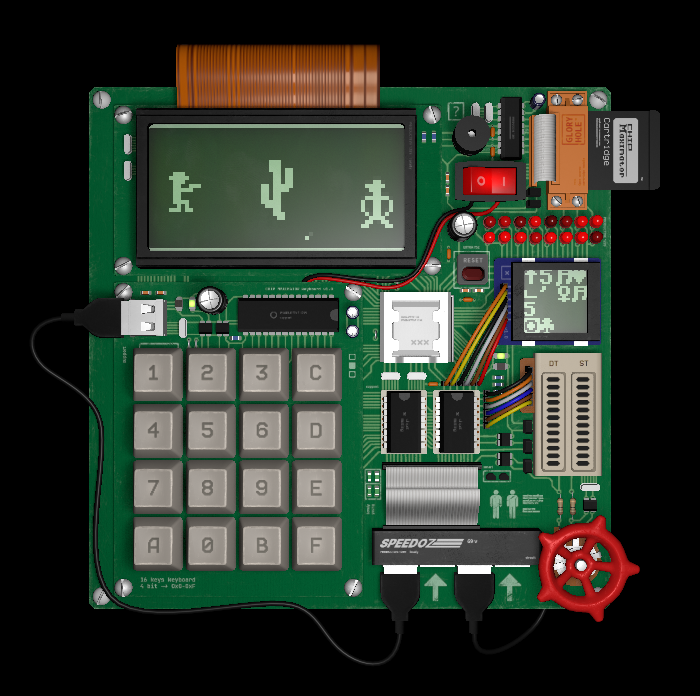
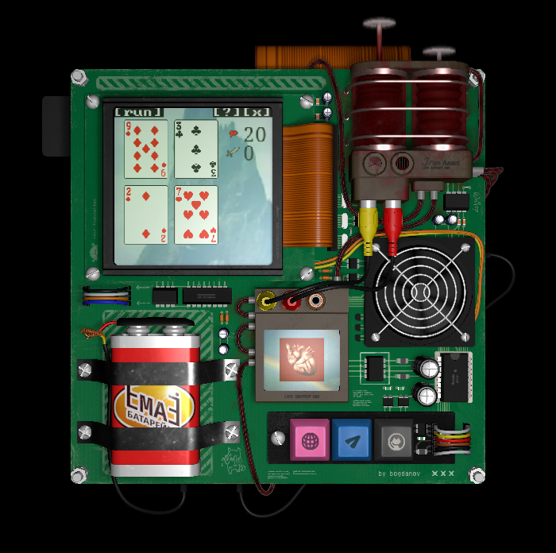
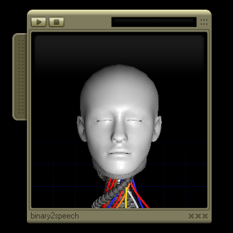

# CHIP MAXIMATOR

*To be added...*

TODO: move all links/references/acknowledgements into a separate markdown file


## Screenshots








## Building

*Only tested on Linux and Web builds*

To build this EXPERIENCE you have to install the [RUST](https://www.rust-lang.org) programming language first

Build and run natively:

```sh
cargo run --release
cargo run --release -- path/to/game.rom
```

Build and run web version (NO AUDIO):

```sh
./build-web.sh --release
cd web/
basic-http-server # or any other http server
```


## License

### Code

[MIT license](./LICENSE)

Do whatever you want!

### Assets

[CC BY-NC-SA](./LICENSE-ASSETS)

Images, sounds, blender projects and other assets are distributed under the
Creative Commons license

Do whatever you want! But not for a commercial use (how sad)
